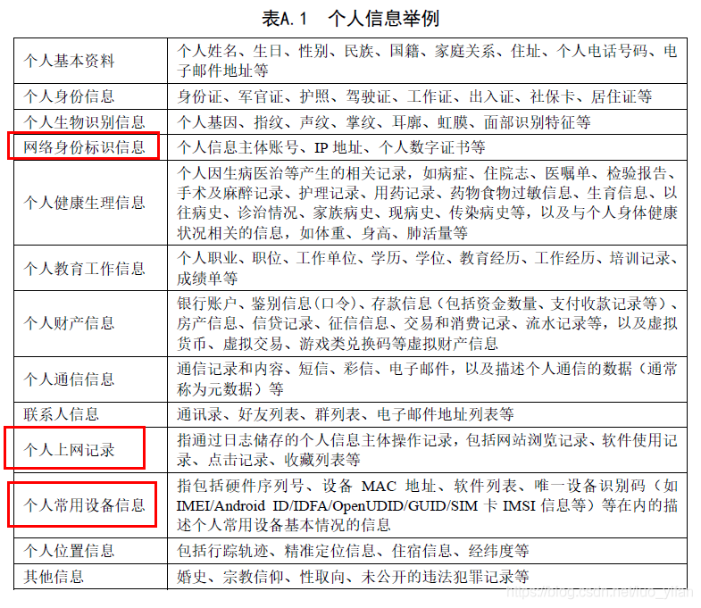

### 全面构筑中国信息及数据安全领域的法律框架：
最新出台的《数据安全法》是我国第一部有关数据安全的专门法律。与业已施行的《网络安全法》不同，《数据安全法》更强调数据本身的安全。而较之尚未出台的《个人信息保护法》，《数据安全法》主要关注数据宏观层面（而非个人层面）的安全。
### 网络安全法

##### 一些key point

######  比如“个人信息”与'“非个人信息”P72
----对个人信息的定义和概念处理

GDPR的关于用户数据定义已非常清晰：personal identifier Information——就是说，如果可以通过该数据定位到用户，则该数据被认为是PII（personal identifier Information）其中既包括姓名、身份证号码、定位数据、在线身份识别等自然人的标识信息物理、也包括生理、遗传、心理、经济、文化或社会身份等自然人的要素。任何针对 PII的搜集，都必须明确的询问用户是否同意。

###### 域名-IP-相关
（哎 下学期学计网）

#WHOIS 目录是一个可供搜索的列表，囊括当前在世界各地注册的每一个域名，其中包括域名持有人的姓名、地址以及其他详细信息。
世界互联网名称与数字地址分配机构 (ICANN) 要求：经过认证的注册商必须在域名注册后马上在 WHOIS 列表中发布域名相关的信息。
#域名的WHOIS信息一般指该域名的所有人、注册日期、过期日期等信息，这些信息由管理该顶级域名的管理机构提供，比如中国的CN域名由CNNIC提供，COM/NET由VeriSign提供

#根据ICANN（互联网名称与数字地址分配机构）《通用顶级域名注册数据临时政策细则（Temporary Specification for gTLD Registration Data）》和欧盟通用数据保护条例（GDPR）合规要求，为保护用户隐私，域名WHOIS将不显示个人信息，通过WHOIS来查询域名持有者的信息将成为历史。
ICANN颁布了《通用顶级域名注册数据临时政策细则》，该细则要求调整 WHOIS 公开显示的信息。即注册商提供WHOIS查询服务时不再显示域名持有者提供的注册人、管理联系人以及技术联系人的个人数据。新的临时政策细则为适应《通用数据保护条例》规定， 在查询域名注册信息时只会显示注册商及到期日期等。

--对于中国而言，.cn的域名不在GDPR适用范围内，但凡是务涉及到欧盟成员国，或者数据不小心涵盖欧盟成员国公民，就必须要遵循，否则会被处以高额罚金（好像真的很多）。具有前瞻性的企业势必要面对各个国家不断严苛的域名隐私法规。

#好吧于是现在不能直接通过但是域名泄露个人信息了，但是域名可以可以查到IP呀！虽然获得IP还有几种其他方式：通过日志、邮件、查询工具等等。那么IP可以查到的信息：（现学现卖 一天之前的我还不知道域名和IP具体都是啥www）
IP分为保留IP和非保留的IP， 0.0.0.0～0.255.255.255 以及127.0.0.0~127.255.255.255 这些段的缺失，因为这两段的 IP 有着特殊的用途，这两段的 IP 均为保留的 IP 段。当然保留的 IP 段还有很多，像 192.168.1.1 这样的局域网 IP 也属于保留的 IP。
由于保留 IP 同一时间内全球不唯一，因此无法根据保留 IP 定位出其经纬度。
而对于非保留 IP 来说，通常也可以被称为公网 IP，由于同一时间内其全球唯一，因此可以借助一定的方法来==找出其经纬度。也就是找到具体的位置（城市）信息。同时也可以获得AS Number，即自治系统编号==（互联网可以认为是由大大小小的自治系统来组成，以中国电信为例，所有的中国电信宽带用户就组成了一个自治系统，当然电信也可能由多个自治系统。同理中国移动和中国联通也有同样的自治系统，全世界的电信运营商，每一家都是一个自治系统。为了管理这些自治系统，需要给每一个自治系统进行统一的编号，那么相应的编号就是 AS number）。
 MaxMind 公司提供了很多的数据库来记录非保留 IP 地址各方面的信息，包括该 IP 是否是代理，该 IP 是否是匿名 VPN，该 IP 可能对应的域名等等更多方面的信息。但是这些数据库都是收费的，从中可以看出非保留 IP 之所以有这方面的对应信息是因为非保留 IP 地址通常作为一项服务具有连续性，比如该 IP 地址对应的域名在一两年之内不会发生变化。因此像 MaxMind 就收集了这方面的信息制作成库，同时提供操作的 API。值得注意的是，在数据从 HTTP 逐渐全面过度到 HTTPS 时代，==IP 数据库==作为分析加密数据一个重要的方面，会显得越来越重要。

###### 其他个人信息类型的司法解释或者新规范--人脸识别（生物识别）

人脸信息属于敏感个人信息中的生物识别信息，是生物识别信息中社交属性最强、最易采集的个人信息，具有唯一性和不可更改性，一旦泄露将对个人的人身和财产安全造成极大危害，甚至还可能威胁公共安全。《人脸识别应用公众调研报告》显示，在2万多名受访者中，94.07%的受访者用过人脸识别技术，64.39%的受访者认为人脸识别技术有被滥用的趋势，30.86%受访者已经因为人脸信息泄露、滥用等遭受损失或者隐私被侵犯。

专门针对人脸信息进行立法的国家在少数。大多都寻求了个人信息保护法中敏感信息一类的规制保护,而其中最具代表性的无疑就是欧盟模式和美国模式。从法理基础上看,欧盟立法对个人信息的属性采用基本权利说，主张个人信息是一项独立权利、应进行独立保护;美国立法则是基于传统的隐私权理论,引入信息隐私的概念,将个人信息纳入隐私权保护的框架之下。

2021年7月28日上午，最高人民法院召开新闻发布会，发布《最高人民法院关于审理使用人脸识别技术处理个人信息相关民事案件适用法律若干问题的规定》。
《规定》第2条至第9条主要从人格权和侵权责任角度明确了滥用人脸识别技术处理人脸信息行为的性质和责任。其中，第2条规定了侵害自然人人格权益行为的认定，针对“3.15晚会”所曝光的线下门店在经营场所滥用人脸识别技术进行人脸辨识、人脸分析等行为，以及社会反映强烈的几类典型行为，该条均予以列举，明确将之界定为侵害自然人人格权益的行为。针对部分商家采用一次概括授权、与其他授权捆绑、“不同意就不提供服务”等不合理手段处理自然人人脸信息的，第2条和第4条明确，处理自然人的人脸信息，必须征得自然人或者其监护人的单独同意；对于违反单独同意，或者强迫、变相强迫自然人同意处理其人脸信息的，构成侵害自然人人格权益的行为。==（侵权行为的界定）==
《规定》第10条至第12条，主要从物业服务、格式条款效力、违约责任承担等角度对人民群众普遍关心的问题予以回应。针对物业服务企业或者其他建筑物管理人以人脸识别作为业主或者物业使用人出入物业服务区域的唯一验证方式的，第10条明确，不同意的业主或者物业使用人请求其提供其他合理验证方式的，人民法院依法予以支持。针对信息处理者通过采用格式条款与自然人订立合同，要求自然人授予其无期限限制、不可撤销、可任意转授权等处理人脸信息的权利的，第11条规定，自然人依据民法典第497条请求确认格式条款无效的，人民法院依法予以支持。第12条对自然人请求信息处理者承担违约责任并删除其人脸信息的情形作了规定。==（以保护自然人利益为宗旨）==
在人工智能深度学习突飞猛进的今天，大量的数据被收集、处理、分析...传统的个人信息，尤其是敏感信息的界定需要随着技术的发展不断地更新，对诸如人脸信息、声纹信息等的隐私保护必然要依赖于不断完善的法律法规的建立，共同形成信息安全保护体系。

### ---数据安全法

##### 新法的要点、亮点、改变点解读

###### 1、

总则部分规定了《数据安全法》所称数据，是指任何以电子或者非电子形式对信息的记录。参照《网络安全法》第七十六条第四款：“网络数据，是指通过网络收集、存储、传输、处理和产生的各种电子数据”，将《网络安全法》调整的数据限定为“电子数据”。==（增加了非电子数据）==

###### 2、

为有效应对境内外数据安全风险，法律要求建立数据安全制度。这一章也构成了本法的一大亮点。

首先，包括建立==数据分级分类管理制度，确定重要数据保护目录==。做好数据安全需要做很多事情，需要针对数据的收集、存储、使用、加工、传输、提供、公开等各个环节进行数据安全风险的监测、评估和防护等，也需要用到权限管控、数据脱敏、数据加密、审计溯源等多种技术手段。

只有做好了数据分类分级工作，才能做好的后续的数据安全建设。国家将建立数据分类分级保护制度不仅是数据安全治理的第一步，也是瞄准了当前数据安全治理的痛点和难点。

《数据安全法》特别强调，「关系国家安全、国民经济命脉、重要民生、重大公共利益等数据属于国家核心数据，实行更加严格的管理制度。」对「重要数据」实施重点保护。《数据安全法》采用目录管理的方式，明确将“确定重要数据目录”纳入国家层面管理事项，国家数据安全工作协调机制统筹协调有关部门制定重要数据目录。而各地区、各部门制定本地区、本部门及相关行业、领域的重要数据具体目录，有利于形成国家与各地方、各部门管理权限之间的合理协调机制，推动重要数据统一认定标准的建立。在保护要求上，《数据安全法》在一般保护之外，强化了重要数据、核心数据的保护要求。==《数据安全法》建立数据安全风险评估、报告、信息共享、监测预警和应急处置机制，通过对数据安全风险信息的获取、分析、研判、预警以及数据安全事件发生后的应急处置，实现数据安全事前、事中和事后的全流程保障。==《数据安全法》第二十二条规定：“国家建立集中统一、高效权威的数据安全风险评估、报告、信息共享、监测预警机制。国家数据安全工作协调机制统筹协调有关部门加强数据安全风险信息的获取、分析、研判、预警工作。”第二十九条规定：“开展数据处理活动应当加强风险监测，发现数据安全缺陷、漏洞等风险时，应当立即采取补救措施……”从制度衔接上看，数据安全风险评估、报告、信息共享、监测预警机制是国家安全制度的组成部分。《国家安全法》第四章第三节建立了风险预防、评估和预警的相关制度，规定国家制定完善应对各领域国家安全风险预案。数据安全风险评估、报告、信息共享、监测预警机制是《国家安全法》规定的风险预防、评估和预警相关制度在数据安全领域的具体落实。从保护阶段上看，==数据安全风险评估、报告和信息共享构成了数据安全保护的事前保护义务，监测预警机制构成了数据安全保护的事中保护义务，数据安全事件的应急处置机制形成了对数据安全的事后保护。==

==其次，数字鸿沟问题。==近年来，随着公共服务数字化，老年人、残疾人在运用智能技术方面的问题逐渐浮现。在草案基础上，《数据安全法》在「数据安全与发展」一章新增条款关注老年人、残疾人「数字鸿沟」问题：

「国家支持开发利用数据提升公共服务的智能化水平。提供智能化公共服务，应当充分考虑老年人、残疾人的需求，避免对老年人、残疾人的日常生活造成障碍。」

###### 3、

加强对向境外司法或执法机构提供存储于中国境内的数据的监管。这一点对于企业来说，尤为重要。
相比《网络安全法》，本法规定了更为广泛的域外司法管辖范围（「属地」加「保护性管辖」的管辖原则，即只要中国境外的司法或者执法机构要求提供存储于中国境内的数据，均适用本条的规定。）==一是针对重要数据完善了跨境数据流动制度==，《数据安全法》在《网络安全法》第三十七条的基础之上，规定“其他数据处理者在中华人民共和国境内运营中收集和产生的重要数据的出境安全管理办法，由国家网信部门会同国务院有关部门制定。”既与《网络安全法》相衔接，也实现了对所有重要数据出境的安全保障。==二是通过出口管制的形式限制了管制物项数据的出口==，《数据安全法》第二十五条规定“国家对与维护国家安全和利益、履行国际义务相关的属于管制物项的数据依法实施出口管制”，明确将数据出口管制纳入数据安全管理工作中，实现了与《出口管制法》的衔接，有利于从维护国家安全的角度限制相关数据的出境，对整体跨境数据流动制度进行补充。==三是对外国司法、执法机构调取我国数据的情况进行了规定==。《数据安全法》第三十六条首先明确“中华人民共和国主管机关根据有关法律和中华人民共和国缔结或者参加的国际条约、协定，或者按照平等互惠原则，处理外国司法或者执法机构关于提供数据的请求。”同时规定“非经中华人民共和国主管机关批准”不得向境外执法或司法机构提供境内数据，并对违法违规提供数据的行为，明确了包括警告、罚款等在内的行政处罚措施。这一制度的设置体现了对于合法合规向外国司法或者执法机构提供数据的重视，明确了我国处理外国司法或者执法机构关于提供数据请求的一般原则，同时也是依法应对少数国家肆意滥用长臂管辖，防范我国境内数据被外国司法或执法机构不当获取。

###### 一些对比思考.jpg
所谓“数据分级分类制度”和“重要数据目录”都是数据安全法提出的中国特色的新概念，但是对“分级分类保护”进行描述的条文仅第二十条一处，容易使“分级分类保护”无法发挥应有的作用。在大数据战略下，数据虽然是国家的基础性战略资源，但必然存在大量无价值的垃圾数据，通过“分级分类”确定的高价值重要数据才是数据安全法的保护对象。因此，==“分级分类”制度可谓核心制度，没有“分级分类”制度就无法界定该法的调整对象，也无法落实跨境保护制度与重要数据保护制度等其他制度==。因此，应设立专章或者通过司法解释对“数据分级分类制度”进行详细规定。另外，同样是在《数据安全法》第二十一条中，有确定重要数据目录、加强对重要数据保护的规定，但没有对该条中的重要数据进行解释。欠缺对重要数据这一术语的届定，不利于确定重要数据目录，亦不利于加强对重要数据的保护。
另外，数据安全保护环节企业责任义务形式较为单一。一些互联网企业掌握和处理着大量的数据资源，因而企业在维护数据安全方面的责任不容忽视。《数据安全法》对企业的责任义务规定较为笼统。具体体现在，虽然如第八条是关于企业诚实守信、遵守商业道德的原则性规定，但并未具体说明企业在维护数据安全方面具体应履行哪些义务，例如是否需要定期开展数据安全外部合规审计、进行企业内部的数据安全教育培训等。另外，如果企业违反了上述原则，现有的《数据安全法》中也欠缺具有针对性和多样化的企业法律责任形式，如计入诚信档案、职业禁止等。可以考虑创新企业违法责任形式，引入信用管理，将企业违反数据安全法的行为纳入企业信用评级体系，反向督促企业加强数据安全管理。（可以借鉴BCR注重企业自我监督功能）对于直接涉及的公司高层和主管人员，可采取职业禁止的处罚方式，以改善目前草案处罚方式单一无力的状况。提升企业维护数据安全的意识，防止因数据安全事件给国家、社会、组织和公民带来损失，真正达到预防数据违法行为的目的。
//它就是蛮笼统的整个（）

##### 数据跨境流动
###### 背景
#在全球化的背景下，大数据具有总量大（Volume）、类型多（Variety）、速度快（Velocity）、易变性（Variability）、价值性（Value）的 5V 特性。各类数据被跨境收集、存储、使用和转移已经成为常态。
这些问题：
#然而，由于不同国家对数据保护的现行立法体系规则具有差异性，数据掌控者将数据转移至其他国家的==目的有可能是规避本国对数据保护的相关规定，造成数据滥用并侵害数据相关主体的个人数据权或者隐私。==
#==多源信息融合技术==的发展使国家秘密与非秘密之间的界限不再清晰，原本不会给国家安全造成威胁的个体数据在达到一定规模并与其他信息融合、经过处理和分析后，也很有可能对国家安全和社会公共利益造成严重威胁。
#大数据具有类型多和易变性的特点，==现有法律规则体系无法涵盖大数据时代的新型数据类型。==
#数据是信息的形式和载体，信息是数据的表达内容，数据中蕴含的信息通过信息技术进行提炼而得出。==不同国家的信息技术水平存在着差异，对一国无价值的数据，其他国家却可能提炼出关乎国家安全的高价值信息。==

###### 各国相关法规的进展

欧盟的GDPR从《OECD指南》（1980年经合组织制定的过《关于隐私保护和个人跨境数据转移指南》）逐步发展而来，以世贸组织框架下的《服务贸易总协定》（GATS）隐私例外条款为国际法依据，建立了一套针对第三国家或地区的资质认定体系，对欧盟个人数据信息进行保护，严格限制数据的跨境流动，保障公民个人隐私权与国家社会利益。为保障大数据时代数据跨境流动，促进生产力发展，欧盟的SCC（标准合同条款）与BCR （BCR是专门针对总公司或者子公司在欧盟区域内的跨国公司的规则体系，目的是避免位于欧盟的跨国公司向欧洲之外的分支机构频繁地传输信息数据时，根据SCC每次都签订标准合同条款，降低生产效率，加重企业负担的问题，因此跨国公司集团内部需要按照GDPR的规定制定公司内部的约束性公司规则，并提交欧盟审批，审批通过后不再需要签订标准合同条款）体系解决了第三国无法通过 GDPR 评估时的数据跨境流动问题。由于不同法域的国家政治、经济、文化差异巨大，不同地域的数据保护模式存在着差异，欧盟的BCR和美国主导下的CBPR（和BCR具有相似性，都是针对自愿加入相关规则的跨国企业对本区域个人数据的保护规则体系）可被看作不同数据保护模式的延展性成果，将纯粹的欧洲保护模式与纯粹的美国保护模式进行了融合。
但在实践中，GDPR的资质认定体系存在着诸多问题，首先，1995年《指令》生效以来，通过认定的国家或地区寥寥无几，从侧面反映出资质认定条件的不合理；其次，欧盟的某些评估标准过于主观，如 GDPR 第 45 条之“法治、对人权与基本自由的尊重”被作为评估标准之一，而具体的法治与人权的评价标准却不得而知，过于主观的评价标准容易使之失去公信力。此外，“棱镜计划”曝光后，美国主导下的CBPR 体系能否真正维护安全的数据跨境流动也不得而知。

###### 《数据安全法》出台后我国的数据跨境流动规范与欧美现行措施对比
面对GDPR过高的充分性认证条件，欧盟BCR和美国主导下的 CBPR 体系是当今世界最主流的两种数据跨境规则体系。我国互联网发展晚于欧美，数据立法在近几年才起步，面对欧美的BCR和CBPR 体系和欧美占领的数据主权的先机，==应该坚持维护我国的数据自主权，完善我国特有的数据分级分类制度==。《数据安全法》中数据跨境相关的规定在前面数据安全法的解读中作为一大亮点进行了总结，但是（小声）在对比中发现，由于还缺乏实践以及原则性条款比较多，并且暂时可能不会有相应的司法解释来支撑，极易导致企业具体实践中的无所适从和监管主体的肆意执法。因此，应当像 GDPR 与 CPBR 一样，对认证标准、数据跨境审批机构、监管机构等做出详细规定。比如，可效仿GDPR第四十四条的规定，对第三国实施充分性认定，禁止向数据保护水平低于我国的第三国或国际组织进行数据跨境流动。同时效仿GDPR第四十五条，对第三国与国际组织的资质认定标准、认定后的周期性审查、第三国或国际组织经认定后不再具有认定资质的情况、补救措施等做出详细规定。对于未经认定而进行数据跨境转移的违法责任，以及特殊情况下未经充分性认定的数据跨境转移特许等内容进行规定。为保障我国企业数据利益，还可灵活借鉴 GDPR 中的标准合同条款（SCC）和约束性公司规则（BCR）的规定，充分保障我国企业跨境数据流动的安全和发展利益。除欧盟 GDPR外，也可以从美国主导的APEC跨境隐私规则（CBPR）中吸取经验和教训，完善我国数据立法的数据跨境流动审查制度、重要数据境内储存制度以及数据主体审核制度，保障我国数据立法的域外效力和数据主权。

##### 《网络安全审查办法》
网络安全审查制度与数据安全审查制度是《网络安全法》和《数据安全法》确立的两项重要国家安全审查制度。《网络安全法》第三十五条规定：“关键信息基础设施的运营者采购网络产品和服务，可能影响国家安全的，应当通过国家网信部门会同国务院有关部门组织的国家安全审查。”《数据安全法》第二十四条规定：“国家建立数据安全审查制度，对影响或者可能影响国家安全的数据处理活动进行国家安全审查。”根据上述规定，==《数据安全法》中的数据安全审查制度与《网络安全法》中的网络安全审查制度有所不同==，前者的审查主要针对影响或者可能影响国家安全的数据处理活动，主要包括：数据的收集、存储、使用、加工、传输、提供、公开等；后者的审查主要针对关键信息基础设施运营者采购网络产品和服务，影响或可能影响国家安全的情形。
该办法一是明确和细化了我国网络安全审查的具体要求，为关键信息基础设施运营者申报审查提供了指引，二是构建起了多部门协同配合的组织体系，为关键系统设备上线运行及服务采购设立了严格的安全门槛，三是建立了网络安全产品和服务安全风险预判机制，从识别威胁、化解风险的角度，推动安全关口前移，强化供应链安全风险管控，提升网络安全保障水平。
#另外，由于《审查办法》是 2020 年实施的，其内容只涉及了《网络安全法》中的“网络安全审查”制度，没有涉及《数据安全法》中的“数据安全审查”内容。因此，==有必要在原有《审查办法》的基础上增加数据安全审查的内容。==

### 未来的个人信息保护法

专门规范保护个人信息的法律《中华人民共和国个人信息保护法》目前正在制定中，将对个人信息数据的保护交给该法即可。对于不关乎国家“基础性战略资源”的信息数据，如企业商业机密等，通过《中华人民共和国反不正当竞争法》《中华人民共和国侵权责任法》或者《中华人民共和国专利法》《中华人民共和国商标法》《中华人民共和国著作权法》等法律进行调整即可。即未来应当进行更明确的分级分类制度，各部法律法规在各自着重的方向上逐渐明确和完善、各司其职，共同构筑我国网络安全法律体系。
