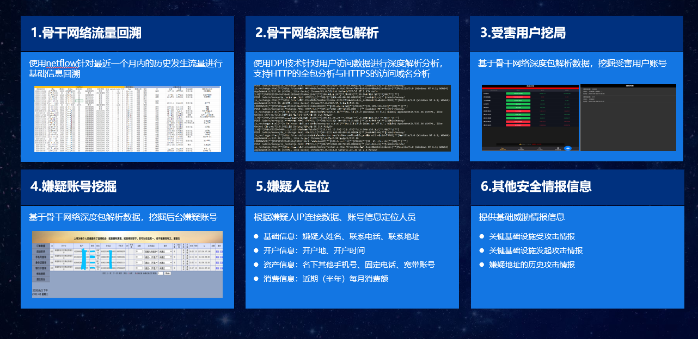

### 云堤-抗d
#### ddos攻击
分布式拒绝服务（Distributed Denial of Service，简称DDoS）将多台计算机联合起来作为攻击平台，通过远程连接利用恶意程序，对一个或多个目标发起DDoS攻击，消耗目标服务器性能或网络带宽，从而造成服务器无法正常地提供服务。
单一的DoS攻击一般是采用一对一方式的，它利用网络协议和操作系统的一些缺陷，采用欺骗和伪装的策略来进行网络攻击，使网站服务器充斥大量要求回复的信息，消耗网络带宽或系统资源，导致网络或系统不胜负荷以至于瘫痪而停止提供正常的网络服务。与DoS攻击由单台主机发起攻击相比较，分布式拒绝服务攻击DDoS是借助数百、甚至数千台被入侵后安装了攻击进程的主机同时发起的集团行为
一个完整的DDoS攻击体系由攻击者、主控端、代理端和攻击目标四部分组成。主控端和代理端分别用于控制和实际发起攻击，其中主控端只发布命令而不参与实际的攻击，代理端发出DDoS的实际攻击包。对于主控端和代理端的计算机，攻击者有控制权或者部分控制权．它在攻击过程中会利用各种手段隐藏自己不被别人发现。真正的攻击者一旦将攻击的命令传送到主控端，攻击者就可以关闭或离开网络．而由主控端将命令发布到各个代理主机上。这样攻击者可以逃避追踪。每一个攻击代理主机都会向目标主机发送大量的服务请求数据包，这些数据包经过伪装，无法识别它的来源，而且这些数据包所请求的服务往往要消耗大量的系统资源，造成目标主机无法为用户提供正常服务。甚至导致系统崩溃。
DDoS的表现形式主要有两种，一种为流量攻击，主要是针对网络带宽的攻击，即大量攻击包导致网络带宽被阻塞，合法网络包被虚假的攻击包淹没而无法到达主机；另一种为资源耗尽攻击，主要是针对服务器主机的攻击，即通过大量攻击包导致主机的内存被耗尽或CPU被内核及应用程序占完而造成无法提供网络服务。当被DDoS攻击时，主要表现为：
(1)被攻击主机上有大量等待的TCP连接。
(2)网络中充斥着大量的无用的数据包，源地址为假。
(3)制造高流量无用数据，造成网络拥塞，使受害主机无法正常和外界通讯。
(4)利用受害主机提供的服务或传输协议上的缺陷，反复高速地发出特定的服务请求，使受害主机无法及时处理所有正常请求。
(5)严重时会造成系统死机。
#### 该抗D产品
异常流量监测：通过对客户网络流量进行学习，“电信云堤·抗D”攻击防御平台为客户制定安全基线，并设定基线内容阈值参数或模型。
中国电信DDoS攻击防护团队提供7x24小时的实时流量监测服务，对可能造成业务影响的DDoS攻击或其他网络流量异常启动预警和防护机制。

流量压制：依靠RTBH、FlowSpec、QoS策略，“电信云堤·抗D”攻击防御平台基于电信IP网核心路由设备能力在中国电信骨干网络边缘将攻击流量进行可区分方向的丢弃、限速和其他QoS动作。
为客户提供定制化的DDoS攻击流量防护策略，按照防护策略自主进行DDoS攻击防护，流量压制功能的攻击流量处理能力理论上无上限。

流量清洗：利用全球部署的36+7云网协同清洗节点实现全自动化集中调度，攻击流量在进入电信网络后将自动被就近牵引到多个清洗中心进行处理。“电信云堤·抗D”总清洗容量和清洗中心独享带宽均超过1000Gb。

### 云堤-域名无忧
#### 域名系统(DNS)攻击

1.针对DNS的攻击方式主要有以下两种：
    第一种是拒绝服务攻击，因为所有计算机都依赖于它们的本地DNS服务器和因特网中的权威域名服务器，如果这些服务器受到攻击而无法响应请求，计算机就找不到IP地址，这本质上就破坏了计算机之间的通信能力。
    第二种是DNS欺骗攻击，这种攻击的主要目的是给受害者提供虚假的IP地址，诱骗他们与攻击者的计算机通信。
	
2.域名系统是一个很复杂的系统，它涉及因特网中大量的域名服务器，这就导致攻击者可以从多个方面对域名系统发起欺骗攻击。
    在受感染的计算机中攻击：通过修改/etc/resolv.conf，攻击者可以用一个恶意DNS服务器作为受害者的本地DNS服务器，从而控制整个DNS解析过程。通过修改/etc/hosts文件，攻击者可以在这个文件中增加新纪录，给某些特定的域名提供IP地址。
    攻击用户机。当用户给本地DNS服务器发送DNS请求时，攻击可以立即发送一个欺骗的回复，用本地DNS服务器作为它的源IP地址。
    攻击本地DNS服务器：缓存中毒攻击。当本地DNS服务器向因特网的DNS服务器发送迭代请求时，攻击者可以发送欺骗回复给本地DNS服务器，只要欺骗回复比合法回复先到达，他们就会被接受，欺骗回复的信息通常被本地DNS服务器缓存，因此危害可能会持续一段时间，这个攻击也常称为DNS缓存中毒。实现攻击最重要的一点是能够伪造DNS回复，这个回复是UDP数据包，为了实现为找UDP数据包，攻击者需要知道请求中的一些参数，如UDP源端口号、请求交易ID、请求问题等。
    从恶意DNS服务器发起攻击。当用户访问网站时，如attacker32.com，一个DNS请求最终会到达attacker32.com的权威域名服务器，除了在响应的回复部分提供IP地址，这个域名服务器还会提供授权和附加信息，如果用户不加选择地接受域名服务器提供的所有信息，攻击可以通过提供虚假信息来达到攻击的目的。
#### 该产品
DNS安全：中国电信监测到全网平均每日活跃域名3亿个，域名解析变化次数达到每分钟30万次
域名无忧：帮助政企客户实时监测域名解析情况，发如发生解析异常、被劫持等情况及时预警，并提供电信全网缓存修正服务

域名监控
及时发现域名的恶意篡改
探针主动监测
镜像数据实时分析

域名修正
快速实现电信全网DNS与源站权威DNS的数据同步

### 天翼-安全网关

### 云堤-金融反诈
这不叔叔讲的那个嘛。。？

叔叔讲的啥来着让我想想，就监控到流量啥的不正常的IP 然后披一个假的外皮（装成这个坏人。。？）去看他都干了啥。。？（嗯对，所以违法了）